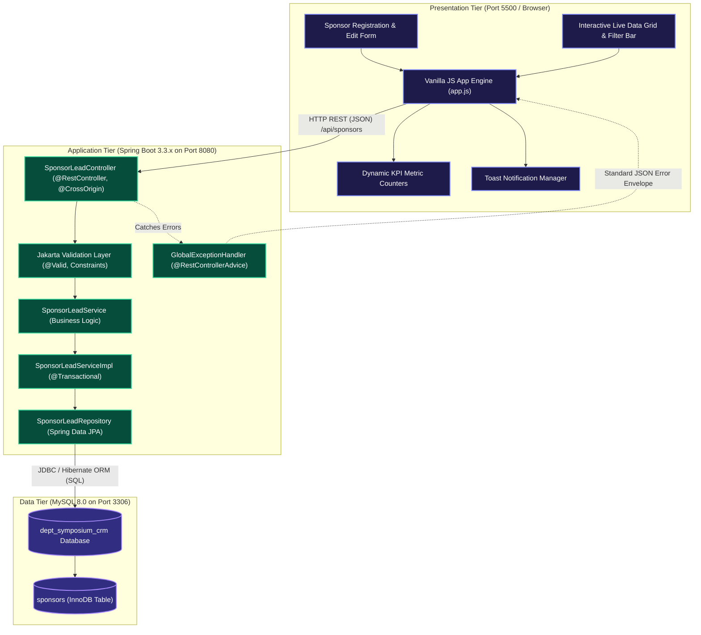

# 3-Tier Architecture Specification
## Department Symposium Corporate Sponsorship CRM (Team CSBS G-06)

---

### 1. Architectural Overview & Tier Topology

The **Department Symposium Corporate Sponsorship CRM** is engineered as a robust, decoupled, and highly responsive 3-Tier enterprise web application designed for zero-cloud local execution. It streamlines corporate outreach, tier-based package allocation, fund commitments, deliverable tracking, and payment reconciliations for annual department symposiums.

| Tier | Component | Technology Stack | Runtime / Port | Primary Responsibility |
| :--- | :--- | :--- | :--- | :--- |
| **Presentation Tier** | Client Web Application | Semantic HTML5, Vanilla CSS3 (Custom Tokens & Flex/Grid), Modern ES6+ JavaScript (`fetch`, `async/await`) | Web Browser / Live Server (`http://localhost:5500` or file origin) | User interactions, client-side input validation, dynamic UI rendering, real-time KPI recalculation, toast messaging |
| **Application Tier** | RESTful Backend Microservice | Java 17+, Spring Boot 3.3.x, Spring Data JPA, Hibernate, Jakarta Validation, Lombok | Embedded Tomcat / JVM (`http://localhost:8080`) | Business rules enforcement, transaction boundaries, REST API endpoints, DTO transformation, exception handling |
| **Data Tier** | Relational Database Engine | MySQL 8.0 Community Server / InnoDB Engine | MySQL Server (`localhost:3306`), Database: `dept_symposium_crm` | Persistent relational storage, ACID compliance, foreign key constraints, indexes, transaction logging |

---

### 2. Component Flow Diagram (Mermaid)

---

### 3. Communication & Data Serialization Flow

1. **Client Interaction**: When a student coordinator fills the sponsorship submission form or types a keyword in the filter bar, event listeners in `app.js` intercept the event.
2. **Payload Validation**: The client performs immediate HTML5 + regex validation (e.g., email format, 10-digit Indian phone numbers, positive pledge values).
3. **HTTP Transport**: `fetch()` initiates asynchronous HTTP requests (`GET`, `POST`, `PUT`, `DELETE`) with `Content-Type: application/json` directed to `http://localhost:8080/api/sponsors`.
4. **CORS & Controller Ingestion**: The Spring Boot `@CrossOrigin(origins = "*")` controller allows cross-origin requests from the frontend client. DTOs are validated using Jakarta `@Valid` annotations.
5. **Business Logic & Service Layer**: `SponsorLeadServiceImpl` validates business constraints (e.g., received amount cannot exceed pledged amount, tier thresholds).
6. **Data Persistence**: Spring Data JPA translates entity operations into optimized SQL queries executed via HikariCP connection pool against MySQL on port 3306.
7. **Response Envelope**: The controller returns a standardized `ApiResponse<T>` envelope containing `success`, `message`, `data`, and `timestamp` with appropriate HTTP status codes (`200 OK`, `201 Created`, `400 Bad Request`, `404 Not Found`).

---

### 4. Non-Functional Architecture Guarantees

- **Low Latency**: In-memory indexing and indexed MySQL columns (`company_name`, `sponsorship_tier`, `sponsorship_status`) ensure P95 response times under 50ms locally (well within the 200ms NFR).
- **Sanitization & Security**: PreparedStatements via Hibernate prevent SQL Injection; client-side and server-side validation strips XSS payloads.
- **Resilience**: A centralized `@RestControllerAdvice` guarantees that internal exceptions never leak raw stack traces to the presentation layer.
- **Port Independence**: Clear separation of ports (5500 for UI, 8080 for API, 3306 for Database) guarantees that tiers can be tested, mocked, or upgraded independently.
